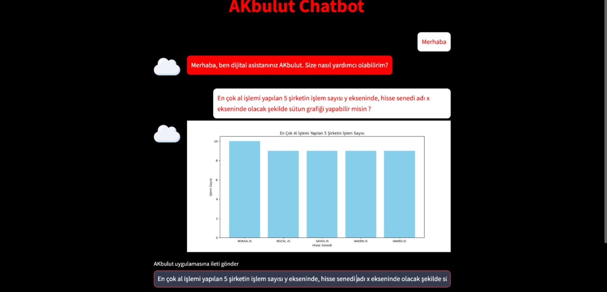
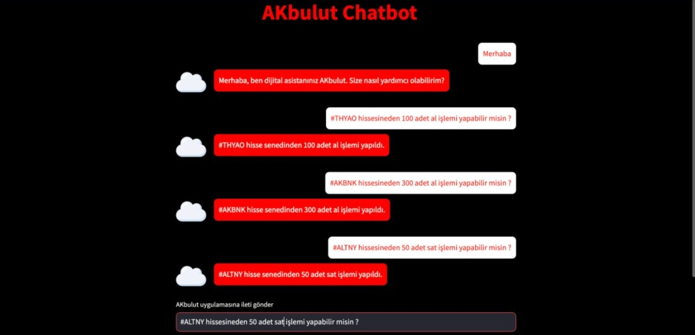
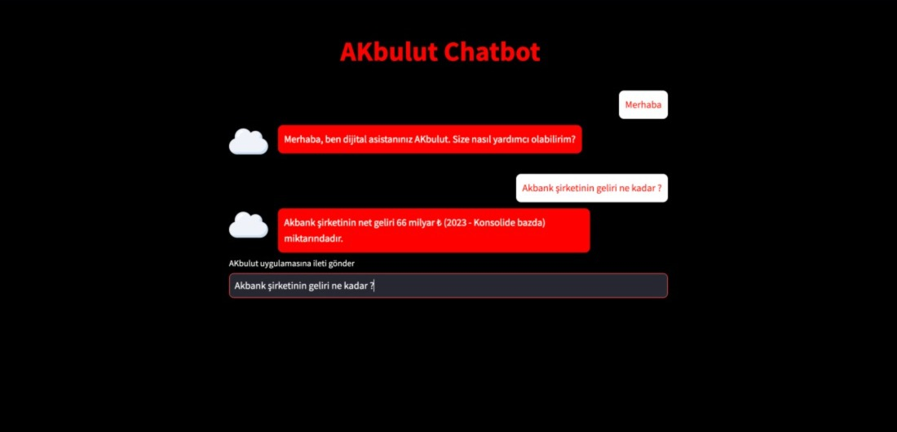

# Akbank Borsa Chatbot

## Tanıtım

**Akbank Borsa Chatbot**, kullanıcıların hisse senedi işlemlerini kolaylaştırmak, portföy yönetimlerini sağlamak ve hisse senetleri hakkında detaylı bilgi sunmak amacıyla geliştirilmiş bir projedir. Bu chatbot, yatırımcıların uygulama içerisinde kendi portföylerinden istedikleri bilgileri kolayca edinmelerini, geçmiş işlemlerine göre analizler alabilmelerini ve hisse senetleri ile ilgili bilgilere hızlı erişim sağlayarak daha bilinçli kararlar vermelerini sağlar. Ayrıca, LSTM model kullanarak geçmiş yatırımlarına bakarak gelecekte yapabilecekleri hisse senetlerini ve sektörleri önerir.

## Özellikler

- **Kullanıcı Dostu Arayüz:** Basit ve anlaşılır bir arayüz ile kolay kullanım.
- **Hisse Senedi Bilgileri:** Hisse senetleri hakkında detaylı bilgi edinme.
- **Portföy Yönetimi:** Kendi portföyünüzü görüntüleyebilir ve yönetebilirsiniz.
- **Geçmiş İşlemler Analizi:** Geçmiş işlemlerinizin detaylı analizlerini alabilirsiniz.
- **Gelecekteki Yatırımlar için Öneriler:** LSTM model ile gelecekte yapabileceğiniz hisse senedi ve sektör önerileri.
  
## Örnek Kullanım

1. **Portföy Bilgisi Görüntüleme:**
   - Giriş yaptıktan sonra, kullanıcı kendi portföyünü görüntüleyebilir ve detaylı bilgilere ulaşabilir.
  
2. **Hisse Senedi Bilgisi Alma:**
   - Kullanıcı, ilgilendiği hisse senetleri hakkında anında bilgi alabilir.
  
3. **Geçmiş İşlemler Analizi:**
   - Kullanıcı, geçmişte yaptığı işlemler hakkında analizler alarak, yatırım stratejilerini gözden geçirebilir.
  
4. **Yatırım Önerileri:**
   - LSTM model kullanılarak, geçmiş yatırımlara dayalı olarak gelecekte yapılabilecek hisse senedi ve sektör önerileri sunulur.

## Kullanılan Teknolojiler

- **Mimari:** RAG (Retrieval-Augmented Generation)
- **Frontend:** Streamlit
- **Backend:** PandasAI, BambooLLM

## Ekran Görüntüleri

<div style="display: flex; justify-content: space-between; flex-wrap: wrap;">
  
  
  
  
  
</div>

## Kurulum Talimatları

1. **Python Yorumlayıcısı:**
   - Cihazınızda Python yüklü değilse, [Python](https://www.python.org/downloads/) indirin ve kurun.

2. **Sanal Ortamın Oluşturulması ve Aktif Edilmesi:**
   - Sanal ortamı oluşturun:
     ```sh
     pip install virtualenv
     virtualenv venv
     ```
   - Sanal ortamı aktif edin:
     - MacOS/Linux:
       ```sh
       source venv/bin/activate
       ```
     - Windows:
       ```sh
       venv\Scripts\activate
       ```

3. **Gereksinimlerin Yüklenmesi:**
   - Proje dizininde aşağıdaki komutu çalıştırın:
     ```sh
     pip install -r requirements.txt
     ```

4. **Uygulamanın Çalıştırılması:**
   - Streamlit uygulamasını başlatın:
     ```sh
     streamlit run app.py
     ```

## Katkıda Bulunma

Projeye katkıda bulunmak isterseniz, lütfen aşağıdaki adımları izleyin:

1. Bu projeyi forklayın.
2. Kendi branch'inizi oluşturun (`git checkout -b feature/AmazingFeature`).
3. Yaptığınız değişiklikleri commit edin (`git commit -m 'Add some AmazingFeature'`).
4. Branch'inizi push edin (`git push origin feature/AmazingFeature`).
5. Bir Pull Request açın.
